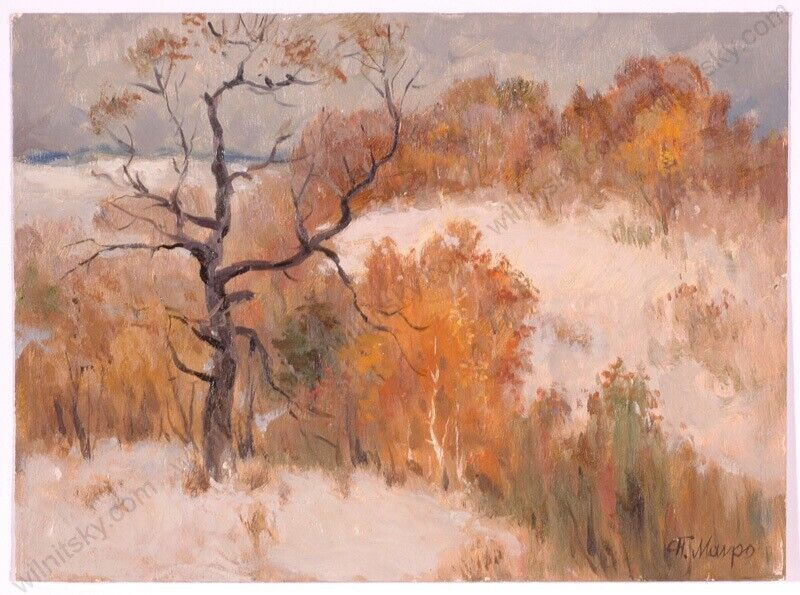
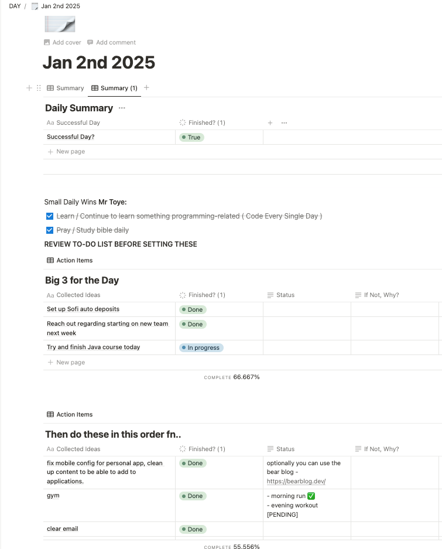

---

# Task Management
### Tools that help me stay organized on tasks

---

## Notion
This is a life-saver and something I use daily to track my tasks and objectives. It allows you to customize your experience, or use a template that suits your needs. 

This is my current daily planner view on notion.

The planner allows me to:
- Score my day ~ (pass/fail) so I know if I am deviating in my focus
- Prioritize tasks and projects to make sure timelines align

Will try and make it available on this page incase anyone feels they could benefit from the organization